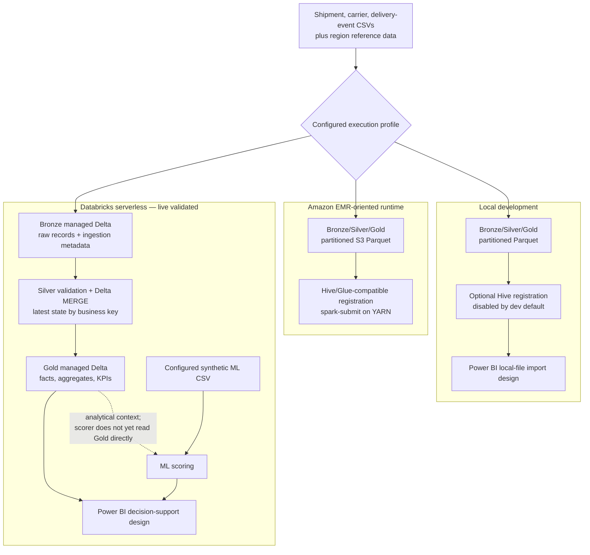

# Supply Chain Transportation Lakehouse & Decision Support

A portfolio project that turns shipment, carrier, and delivery-event CSV data
into trustworthy operational facts, delivery KPIs, carrier/route analytics,
and late-shipment risk scores. The same Python package supports local PySpark,
Amazon EMR-oriented batch deployment, and a live-validated Databricks
serverless implementation without replacing the local or EMR paths.

All included sample and live-validation data is **synthetic**. This repository
does not represent production operations, certified business improvement, or
a deployed Power BI report.

## Business problem and logistics use case

Transportation teams need to answer two connected questions:

1. Where are late deliveries, exceptions, long transit times, and high
   cost-per-mile concentrated?
2. Which shipments may need proactive review before the promised delivery
   time is missed?

Raw operational files are difficult to compare reliably because records can
be malformed, duplicated, updated after first receipt, or expressed at
different grains. This pipeline creates governed shipment and event facts,
then publishes decision-support views for network, carrier, service-mode,
route, region, and exception analysis.

## Implementation status

| Capability | Status |
| --- | --- |
| Local daily and backfill pipeline | Implemented and exercised with synthetic samples |
| EMR runtime | PySpark/S3/Hive-compatible configuration and deployment artifacts implemented; no live EMR cluster validation is claimed |
| Databricks development target | Bundle validated, deployed, and run successfully on Free Edition serverless |
| Databricks tables | Three Bronze, three Silver, and eight Gold managed Delta tables live-validated |
| Silver MERGE and rerun behavior | First-load bootstrap, existing-target MERGE, deterministic update, and business-key uniqueness live-validated |
| Late-risk model | Implemented and run on synthetic data with chronological validation; not production-ready |
| Power BI | Semantic model and three-page report specification only; no PBIX or published report exists |
| DMAIC | Evidence-bounded case-study document only; no intervention or certification claim |

See [Databricks deployment](docs/databricks_deployment.md) for the detailed
live-validation record and limitations.

## Architecture

The runtime profile controls storage and publication behavior. Delta Lake and
Unity Catalog are Databricks-only; local and EMR retain Parquet/Hive behavior.



The diagram deliberately does not imply identical execution paths. The ML
wheel task currently consumes a configured CSV and writes file-based scoring
artifacts; integrating it directly with the Gold shipment table is not
implemented. Power BI is a documented manual build target, not a finished
report.

For layer mechanics and runtime boundaries, see
[Architecture](docs/architecture.md).

## Medallion responsibilities

### Bronze

- Reads shipment, carrier, and delivery-event CSVs using explicit JSON schema
  contracts.
- Preserves source fields and appends ingestion time, source file, batch ID,
  and run date.
- Routes malformed records to configured quarantine storage rather than
  silently discarding them.
- Publishes Parquet on local/EMR and managed Delta tables on Databricks.

### Silver

- Runs schema-drift, required-value, duplicate-key, allowed-value,
  non-negative-value, and timestamp-order checks.
- Applies staging SQL, standardization, deterministic latest-record
  deduplication, and region enrichment.
- Quarantines invalid and dedup-discarded records with rule and source context.
- Uses overwrite/dynamic-partition semantics on local and EMR.
- On Databricks, creates a missing Silver Delta target on first load and then
  executes `MERGE INTO` by `shipment_id`, `carrier_id`, or `event_id`.

### Gold

- Publishes latest-state shipment and event facts plus a dated carrier
  snapshot.
- Produces daily operational aggregates and delivery KPIs.
- Produces carrier/service-mode, route, and delivery-exception analytical
  models for decision support.
- Uses Parquet/Hive-compatible publication on local/EMR and managed Delta
  tables in the configured Databricks Gold schema.

Within a daily run, Gold DataFrames are built from the same validated,
standardized, and region-enriched staging data that feeds the published Silver
layer. The job does not reread the just-published Silver tables before building
Gold.

## Gold decision-support model

| Table | Grain | Primary use |
| --- | --- | --- |
| `dim_carrier` | (`carrier_id`, snapshot `p_date`) | Carrier name, SCAC, service mode, region, and active status |
| `fct_shipment` | Latest row per `shipment_id` | Delivery, delay, transit, distance, cost, and shipment exception analysis |
| `fct_delivery_event` | Latest row per `event_id` | Event timeline, attempts, delay reasons, and exception detail |
| `agg_shipment_daily` | (`p_date`, `region_code`, `carrier_id`) | Additive shipment, delivery, delay, cost, distance, and event totals |
| `kpi_delivery_daily` | (`p_date`, `region_code`, `carrier_id`) | On-time, late, first-attempt, exception, transit, cost, volume, and event-density KPIs |
| `carrier_performance` | (`p_date`, `carrier_id`, `service_mode`) | Carrier and service-mode comparisons |
| `route_performance` | (`p_date`, origin region, destination region, `carrier_id`) | Lane reliability, transit, exception, volume, and cost comparisons |
| `delivery_exception_summary` | (`p_date`, `event_type`, `carrier_id`, `region_code`) | Exception category frequency and delay analysis |

Metric definitions and edge cases are documented in
[KPI definitions](docs/kpi_definitions.md) and
[Curated tables](docs/curated_tables.md).

## Delta Lake, MERGE, and idempotency

Delta is selected only when `spark.profile: databricks` is active:

- Bronze and Gold use managed Delta tables with the configured partition
  columns and overwrite/dynamic-partition behavior.
- Silver performs a first-load `CREATE TABLE ... USING DELTA AS SELECT`, then
  keyed `MERGE INTO` operations that update matches and insert new keys.
- Catalog and schema identifiers are configuration-driven; application code
  does not embed workspace credentials or identity.
- Reprocessing the same source produces the same business-key state. Audit
  timestamps may change by design.

Local and EMR do not require `delta-spark` and continue to write Parquet.
Idempotency there comes from deterministic cleaning/deduplication and the
configured overwrite/dynamic-partition behavior rather than Delta MERGE.

## Data-quality strategy

Quality is enforced at multiple boundaries:

- Explicit schema definitions with configured required fields, types, primary
  keys, allowed values, and numeric minimums.
- Ingestion and Silver quarantine paths for invalid records.
- Deterministic duplicate resolution using latest `updated_at` plus stable
  tie-breakers.
- Configurable blocking behavior for schema drift and required-null failures.
  Repeated business keys are resolved deterministically in Silver rather than
  treated as fatal source errors.
- Unit, integration, SQL-parity, data-quality, ML, and bundle-structure tests.
- A Lakeflow data-quality task that fails the workflow when its pytest suite
  returns nonzero.

The Lakeflow quality task runs the repository's synthetic data-quality suite;
it is not a complete post-write reconciliation of every Unity Catalog table.

## Late-shipment risk model

The `transport-etl-ml` CLI trains either a logistic-regression baseline or a
histogram gradient-boosting classifier using pandas and scikit-learn.

- Target: whether actual delivery occurs after promised delivery.
- Inputs: booking-time attributes plus carrier/route outcomes already
  observable before each shipment pickup.
- Leakage controls: delivery outcomes, post-pickup event fields, and
  retrospective Gold aggregates are explicitly forbidden as model features.
- Validation: chronological 70/15/15 train/validation/test split ordered by
  `pickup_ts`; no random shuffle.
- Output: `risk_probability`, LOW/MEDIUM/HIGH/CRITICAL `risk_band`, and
  `predicted_late`, written with the fitted model and evaluation report.

The documented synthetic results show weak held-out discrimination and
overfitting in the tree model. The output is appropriate for demonstrating a
batch train-and-score review queue, not prospective or automated operational
decisions. Unresolved delivery outcomes are excluded rather than labeled
on-time. See
[Late-shipment risk model](docs/late_risk_model.md).

## Power BI outputs

[Power BI Decision-Support Design](docs/power_bi_report_design.md) defines a
manual semantic model and three proposed pages:

1. Executive Supply Chain Overview.
2. Carrier & Route Performance.
3. Delivery Risk & Exceptions.

It maps each visual and weighted measure to an implemented Gold table, and
documents Databricks SQL Warehouse and local-file import paths. Risk scores
remain an optional CSV input. No screenshots, PBIX file, published semantic
model, or scheduled Power BI refresh is claimed.

## Runtime instructions

### Local

The checked local/CI baseline is Python 3.10 with a Java runtime compatible
with PySpark 3.5.2. Other Python versions allowed by the package metadata may
require platform-specific Spark/Hadoop validation.

```powershell
python -m venv .venv
.\.venv\Scripts\Activate.ps1
python -m pip install -r requirements-dev.txt
python -m pip install -e .
python -m transport_etl.main --job daily --config dev --run-date 2026-01-01
```

Backfill an inclusive date range:

```powershell
python -m transport_etl.main --job backfill --config dev --start-date 2026-01-01 --end-date 2026-01-02
```

The dev profile reads clearly labeled sample data under `data/sample`, writes
to `data/local`, and disables Hive registration by default. Native Windows
Spark may require Hadoop/winutils support for Parquet writes; the dev profile
can fall back to JSON for the affected invalid-record and curated writes.

### Amazon EMR

The production profile selects `spark.profile: emr`, S3 paths, Parquet,
Hive/Glue-compatible registration, dynamic allocation, and fail-fast behavior.
Scripts and step templates under `deploy/emr` package/upload the project and
submit daily or backfill work with `spark-submit` on YARN.

All bucket, IAM role, release, and cluster values are placeholders that an
operator must supply. A live EMR run has not been claimed. Follow
[EMR run instructions](docs/emr_run_instructions.md).

### Databricks

The Databricks profile reuses the serverless-managed Spark session. File-based
inputs and non-table outputs use a configured Unity Catalog Volume; Bronze,
Silver, and Gold publish managed Delta tables.

The Declarative Automation Bundle under `deploy/databricks` builds the project
wheel from the repository root and syncs the runtime configuration, schemas,
staging SQL, sample data, and data-quality tests required by wheel tasks.

```powershell
Set-Location deploy/databricks
databricks bundle validate --target dev --profile <profile>
```

Deployment and execution commands, prerequisites, and verified status are in
[Databricks deployment](docs/databricks_deployment.md). Authentication comes
from a named local CLI profile; no host, username, or token belongs in bundle
configuration.

## Lakeflow Job and Declarative Automation Bundle

The bundle defines one serverless Lakeflow Job with this dependency graph:

```text
ingest_bronze_silver_gold
        |
        v
score_late_risk
        |
        v
data_quality_checks
```

Each task calls a console entry point from the same wheel. The job uses a
serverless environment and has a daily UTC schedule defined but **paused**.
The development bundle and complete three-task workflow were live-validated;
the production target and an active recurring schedule were not.

That live run predates the Phase 15 audit repairs to outcome-aware historical
ML features, Gold-from-Silver lineage, and KPI cohort alignment. The repaired
revision is covered by local regression tests and bundle validation, but has
not been redeployed or rerun in the workspace.

## Unity Catalog organization

Databricks table names follow configuration-driven three-level identifiers:

```text
<catalog>.<bronze_schema>.raw_shipments
<catalog>.<silver_schema>.stg_shipments
<catalog>.<gold_schema>.fct_shipment
```

Separate Bronze, Silver, and Gold schemas isolate layer responsibilities. A
configured Volume stores raw/reference CSVs, quarantine output, audit files,
and ML files. Catalogs, schemas, and the Volume must already exist; the bundle
does not provision or delete them.

## DMAIC case study

[DMAIC Process-Improvement Case Study](docs/dmaic_case_study.md) uses the
implemented delivery, carrier, route, exception, cost, transit, and risk
capabilities to frame a delivery-reliability investigation. It labels platform
capabilities as **IMPLEMENTED** and operational interventions as **PROPOSED
BUSINESS ACTION**. It does not claim certification, causation, deployed
interventions, or measured production improvement.

## Testing

```powershell
pytest -q
ruff check .
black --check .
```

Focused suites include:

```powershell
pytest -q tests/unit
pytest -q tests/integration
pytest -q tests/data_quality tests/sql
pytest -q tests/ml
pytest -q tests/databricks
```

GitHub Actions installs the editable package, smoke-tests CLI entry points,
runs pytest, and checks Ruff and Black on Python 3.10. Live Databricks behavior
is not faked by the local suite; workspace evidence is documented separately.

## Skills Demonstrated

- PySpark batch ETL and Spark SQL staging.
- Bronze/Silver/Gold lakehouse modeling with explicit grain and lineage.
- Schema contracts, quarantine, deterministic deduplication, and quality gates.
- Partitioned Parquet/Hive publication for local and EMR-oriented runtimes.
- Delta Lake managed tables, keyed MERGE, and Unity Catalog naming.
- Databricks serverless Lakeflow Jobs and Declarative Automation Bundles.
- Carrier, route, exception, transit, delivery, and cost KPI modeling.
- Chronological ML evaluation, leakage prevention, scoring, and honest failure
  analysis.
- Pytest-based unit, integration, SQL-parity, data-quality, ML, and deployment
  structure testing.
- Power BI semantic/report design and DMAIC decision-support framing.

## Interview Discussion Points

- **Why medallion architecture?** It separates source fidelity, conformance and
  quality, and business-facing analytics so defects can be traced to the layer
  that owns them.
- **Why Delta MERGE?** Operational entities change after first receipt. A
  business-key MERGE updates existing Silver state and inserts new keys without
  append-only duplication.
- **How does idempotency work?** Stable business keys, deterministic
  latest-record deduplication, same-source MERGE updates on Databricks, and
  overwrite/dynamic-partition writes on local/EMR keep reruns bounded. Audit
  timestamps may change intentionally.
- **How is data quality enforced?** Schema contracts, reusable checks,
  quarantines, fail-fast configuration, business-key validation, and a
  failure-propagating Lakeflow test task make rejected data visible.
- **Why chronological validation?** A random split would allow future shipment
  behavior into training. Sorting by pickup time better represents scoring a
  future booking from past observations.
- **What are the model failure modes?** Synthetic-data bias, weak held-out
  discrimination, tree-model overfit, class imbalance, false-positive review
  load, missing external drivers, and threshold sensitivity.
- **Which decisions are supported?** Carrier/service comparisons, lane and
  region attention, exception prioritization, cost/reliability trade-offs, and
  supervised high-risk shipment review.
- **How do runtimes differ?** Local favors development with sample files and
  optional fallback behavior; EMR is an S3/Parquet/YARN deployment design;
  Databricks uses serverless compute, Volumes, managed Delta tables, Silver
  MERGE, Unity Catalog, and a bundled Lakeflow workflow.

## Project limitations

- All bundled and live-validation inputs are synthetic; no production outcome
  or benchmark is claimed.
- The production Databricks target, active schedule, and a second workspace
  have not been validated.
- EMR artifacts are implemented but have not been exercised on a live cluster.
- The ML scorer reads a configured CSV rather than the Gold shipment table and
  writes file-based artifacts rather than a managed scoring table.
- The data-quality Lakeflow task does not yet reconcile every newly written
  Unity Catalog table.
- ML validation shows limited predictive signal and is not suitable for
  autonomous decisions without real-data retraining and evaluation.
- Power BI remains a manual build specification; no PBIX, published report, or
  refresh configuration exists.
- The DMAIC document proposes actions but does not claim deployed improvements
  or Six Sigma certification.
- Revenue, margin, customer satisfaction, carbon/fuel, exception cost impact,
  and exception time-to-recovery are unsupported because the required source
  data or transformations do not exist.

## Repository layout

- `src/transport_etl` — application, quality, publishing, and ML modules.
- `config` — environment YAML, Spark profiles, and JSON schemas.
- `sql` — staging, quality, curated, Gold, and KPI SQL definitions.
- `data/sample` — synthetic raw and reference inputs.
- `tests` — unit, integration, SQL, data-quality, ML, and bundle tests.
- `deploy/emr` — EMR configuration, packaging, bootstrap, and step templates.
- `deploy/databricks` — bundle, targets, job resource, and wheel artifact path.
- `docs` — architecture, model, deployment, BI, DMAIC, and testing references.

## Documentation

- [Architecture](docs/architecture.md)
- [Data Dictionary](docs/data_dictionary.md)
- [Curated Tables](docs/curated_tables.md)
- [KPI Definitions](docs/kpi_definitions.md)
- [Late-Shipment Risk Model](docs/late_risk_model.md)
- [Power BI Decision-Support Design](docs/power_bi_report_design.md)
- [DMAIC Process-Improvement Case Study](docs/dmaic_case_study.md)
- [Testing Plan](docs/testing_plan.md)
- [EMR Run Instructions](docs/emr_run_instructions.md)
- [Databricks Deployment](docs/databricks_deployment.md)
