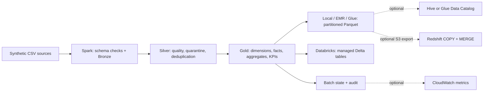

# Transportation Shipment ETL Pipeline

A portfolio batch pipeline that turns synthetic shipment, carrier, and delivery-event CSVs into tested shipment facts and daily delivery-reporting datasets. It uses one PySpark transformation package across local development, EMR-oriented deployment, and an optional AWS Glue Spark job. Databricks is a separate Delta Lake target. This is not a production customer system.

## Architecture



The runtime paths share ingest, quality, and Gold logic, but have different storage and catalog adapters. The optional Glue Data Catalog adapter is distinct from the Glue Spark job. Redshift is a downstream warehouse target, not a Spark runtime. See [architecture](docs/architecture.md).

## What the code demonstrates

- Python, PySpark, and Spark SQL ingest three operational entities, enforce JSON schema contracts, quarantine invalid rows, deduplicate changing records, and build five core Gold tables plus carrier, route, and exception reporting models. See [table grains](docs/curated_tables.md) and [KPI definitions](docs/kpi_definitions.md).
- Local/EMR/Glue profiles write partitioned Parquet; optional Spark Hive registration, Glue Data Catalog registration, and Redshift Data API publication have separate switches. All AWS adapters are locally tested with fake clients; none has been validated in an AWS account.
- Date-and-file manifests track successful batches. A matching rerun skips; changed inputs or processing settings rerun; `--force` overrides a successful checkpoint. This is batch incrementality, not database CDC or streaming.
- Local/S3 audit stores record run outcomes, and optional CloudWatch metrics report low-cardinality operational signals. Bounded retries apply to transient remote API failures, not Spark or data-quality failures.
- The Databricks development bundle and an earlier three-task Lakeflow run were live-validated with synthetic data. [Deployment notes](docs/databricks_deployment.md) distinguish that run from subsequent local-only repairs. A [Power BI report design](docs/power_bi_report_design.md) exists; no PBIX or published report is claimed.

For a claim-by-claim code, test, and cloud-validation inventory, see the [job alignment audit](docs/job_alignment.md). The [interview guide](docs/interview_guide.md) covers design tradeoffs, and the [resume bullet mapping](docs/resume_bullet_mapping.md) ties concise claims to code and tests.

## Quick local run

On Windows, use Python 3.12, PySpark 3.5.2, JDK 17, and the project virtual environment. The [Windows setup guide](docs/windows_setup.md) covers prerequisites. The dev profile uses synthetic files under `data/sample`, writes under `data/local`, and needs no AWS credentials. Native Windows Spark may use the configured JSON fallback for writes that lack Hadoop/winutils support; do not describe those files as Parquet.

```powershell
.\scripts\setup_windows_dev.ps1
.\.venv\Scripts\python.exe -m transport_etl.main --job daily --config dev --run-date 2026-01-01
.\.venv\Scripts\python.exe -m transport_etl.main --job backfill --config dev --start-date 2026-01-01 --end-date 2026-01-02
```

Use `--force` to rerun a date already marked successful. Dev defaults disable Hive, Glue, Redshift, and CloudWatch publication. Pipeline state and JSON audit are enabled.

## Tests and evidence

```powershell
.\.venv\Scripts\python.exe -m pytest -q
.\.venv\Scripts\python.exe -m ruff check .
.\.venv\Scripts\python.exe -m black --check .
.\.venv\Scripts\python.exe -m pip check
git diff --check
```

[GitHub Actions](.github/workflows/ci.yml) runs the CLI smoke checks, pytest, Ruff, and Black on Python 3.10. The repository has unit, Spark integration, SQL-result, data-quality, AWS fake-client, and deployment-structure tests. Passing them does not prove cloud permissions or warehouse performance.

The only checked-in [benchmark artifact](docs/results/local-smoke-60.json) measures a small synthetic local run (60 shipments, 120 events) with `json_fallback`. It proves the measurement harness, not big-data throughput. [Performance notes](docs/performance.md) explain Spark changes, generator commands, and the EMR/Glue benchmark still needed. No million-row ETL run, production-scale result, or numerical improvement is claimed.

## Cloud deployment path

- [EMR instructions](docs/emr_run_instructions.md) describe packaging, S3 inputs, YARN steps, and Hive-compatible output; live EMR execution is unverified.
- [Glue Spark guide](deploy/glue/README.md) describes the reusable-code archive, job parameters, IAM actions, and one manual smoke test; live Glue execution is unverified.
- The optional [Glue Data Catalog and Redshift flows](docs/architecture.md#publication-and-naming) require configured S3 locations, roles, database resources, and an AWS smoke test. No AWS credentials or real resource identifiers are committed.
- [Databricks notes](docs/databricks_deployment.md) document the earlier synthetic development run and remaining validation for the current revision and production target.

All bundled data is synthetic. The late-shipment model has limited held-out predictive signal; [its evaluation](docs/late_risk_model.md) does not support autonomous operational decisions. The [DMAIC case study](docs/dmaic_case_study.md) proposes interventions but reports no deployed business improvement. A portfolio project cannot establish professional employment, real customers, or Amazon-scale operations.
