# Transportation Shipment ETL Architecture

## Overview
This project implements a batch ETL pipeline for shipment operations analytics using:
- PySpark and Spark SQL for distributed transformation
- Hive-style curated tables on Parquet
- Partitioning by `p_date`, `region_code`, `carrier_id`
- Local development mode and Amazon EMR production mode

The design prioritizes reproducibility, data quality, and clear table grain for KPI reporting.

## Logical Flow

```mermaid
flowchart LR
    A["Raw CSV Inputs<br/>shipments, carriers, delivery_events"] --> B["Ingestion Layer<br/>explicit schema + parsing + bad record quarantine"]
    B --> C["Quality Layer<br/>schema drift, null checks, duplicate checks, business rules"]
    C --> D["Staging SQL Views<br/>stg_shipments, stg_carriers, stg_delivery_events"]
    D --> E["Transform Layer<br/>standardize + region enrichment"]
    E --> F["Curated Models<br/>dim_carrier, fct_shipment, fct_delivery_event, agg_shipment_daily"]
    F --> G["KPI Model<br/>kpi_delivery_daily"]
    G --> H["Published Parquet + Hive Catalog"]
```

## Pipeline Layers

### 1. Ingestion
- Reads raw CSV files with explicit schema definitions from `config/schemas/*.schema.json`
- Normalizes raw strings (trim/case handling)
- Parses timestamps with configured formats
- Emits invalid records to quarantine path for triage

### 2. Data Quality
- Detects schema drift against expected schema contracts
- Validates required columns are not null/blank
- Detects duplicate business keys (`shipment_id`, `carrier_id`, `event_id`)
- Applies reusable business rules (allowed values, non-negative metrics, timestamp ordering)

### 3. Staging
- Applies Spark SQL staging logic from `sql/staging/*.sql`
- Produces normalized intermediate views for downstream transforms
- Keeps deduplication and KPI-specific modeling in curated transforms

### 4. Transform and Enrichment
- Standardizes statuses, event types, state/region codes, and carrier text
- Enriches shipment/event records with `region_lookup.csv`
- Builds curated dimensional/fact models with explicit grain

### 5. Publish
- Writes partitioned Parquet datasets
- Partition contract: `p_date`, `region_code`, `carrier_id`
- Optional Hive/Glue metadata registration for downstream SQL consumers

## Curated Data Model
- `dim_carrier`: Snapshot dimension of carrier metadata
- `fct_shipment`: Shipment-level operational facts and KPI-driving columns
- `fct_delivery_event`: Event-level facts for delivery lifecycle analysis
- `agg_shipment_daily`: Daily aggregate at date-region-carrier grain
- `kpi_delivery_daily`: Final KPI output at date-region-carrier grain

## Runtime Modes

### Local
- Uses `config/dev.yaml`
- Reads synthetic sample data under `data/sample/`
- Writes outputs to `data/local/curated`
- Intended for development, unit/integration tests, and demos

### EMR
- Uses `config/prod.yaml` + runtime CLI overrides
- Reads/writes S3 paths
- Executes batch jobs through `spark-submit` on YARN
- Uses deployment artifacts under `deploy/emr/`

## Quality and Failure Strategy
- Invalid ingestion rows are quarantined, not silently dropped
- Quality rule outcomes are logged with failed rule names and counts
- Configurable fail-fast behavior (`runtime.fail_fast`)
- Deterministic transformation functions support idempotent reruns

## Observability
- Structured logging with contextual fields (`run_id`, `job`, `env`, `batch_date`)
- Quality summaries include failure counts and rule status
- EMR steps and Spark logs are directed to configured log destinations

## Security and Portfolio Safety
- No credentials are committed
- EMR and S3 artifacts use placeholders for buckets, IAM roles, and cluster IDs
- Sensitive values are expected via environment variables or runtime parameters
