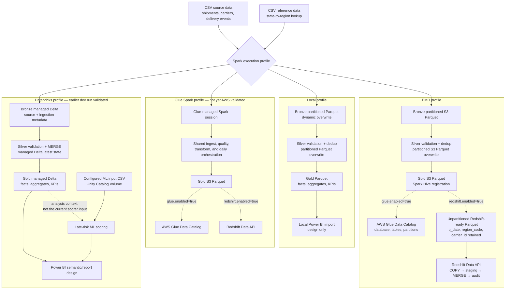
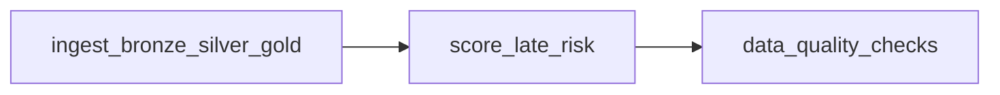

# Transportation Lakehouse Architecture

## Purpose

The project converts shipment, carrier, delivery-event, and region-reference
CSV data into quality-controlled operational facts and decision-support
outputs. It shares transformation logic across local, EMR, and Glue Spark
profiles while keeping each platform's storage and catalog behavior explicit.

- **Local:** development and tests with partitioned Parquet; the dev profile
  disables Hive registration and can fall back to JSON for specific Windows
  Hadoop write failures.
- **Amazon EMR:** S3-backed Parquet and Spark Hive registration, with optional
  separate AWS Glue Data Catalog API registration for five Gold tables. A live
  EMR run is not claimed.
- **AWS Glue Spark execution:** a Glue-managed Spark session invokes the same
  daily ETL and S3 Parquet publication path, with optional Data Catalog and
  Redshift steps. Artifact and adapter tests run locally; no live Glue job
  execution is claimed.
- **Amazon Redshift (optional publication):** selected S3-backed Gold outputs
  can be exported in a COPY-compatible Parquet layout and loaded through the
  Redshift Data API. This path is disabled by default and has fake-client test
  coverage, but no live AWS execution is claimed.
- **Databricks:** serverless Lakeflow Jobs, Unity Catalog Volumes for files,
  managed Delta tables, and Silver Delta MERGE. The development workflow has
  been live-validated with synthetic inputs. Phase 15 correctness repairs are
  locally regression-tested and bundle-validated, but not live-rerun.

## End-to-end topology


```mermaid
flowchart TB
    SRC["CSV source data<br/>shipments, carriers, delivery events"]
    REF["CSV reference data<br/>state-to-region lookup"]
    PROFILE{"Spark execution profile"}
    SRC --> PROFILE
    REF --> PROFILE

    subgraph LOCAL["Local profile"]
        LB["Bronze partitioned Parquet<br/>dynamic overwrite"] --> LS["Silver validation + dedup<br/>partitioned Parquet overwrite"]
        LS --> LG["Gold Parquet<br/>facts, aggregates, KPIs"]
        LG --> LP["Local Power BI import<br/>design only"]
    end

    subgraph EMR["EMR profile"]
        EB["Bronze partitioned S3 Parquet"] --> ES["Silver validation + dedup<br/>partitioned S3 Parquet overwrite"]
        ES --> EG["Gold S3 Parquet<br/>Spark Hive registration"]
        EG -. "glue.enabled=true" .-> GC["AWS Glue Data Catalog<br/>database, tables, partitions"]
        EG -. "redshift.enabled=true" .-> RX["Unpartitioned Redshift-ready Parquet<br/>p_date, region_code, carrier_id retained"]
        RX --> RS["Redshift Data API<br/>COPY → staging → MERGE → audit"]
    end

    subgraph GLUE["Glue Spark profile — not yet AWS validated"]
        GS["Glue-managed Spark session"] --> GE["Shared ingest, quality,<br/>transform, and daily orchestration"]
        GE --> GG["Gold S3 Parquet"]
        GG -. "glue.enabled=true" .-> GGC["AWS Glue Data Catalog"]
        GG -. "redshift.enabled=true" .-> GR["Redshift Data API"]
    end

    subgraph DBX["Databricks profile — earlier dev run validated"]
        DB["Bronze managed Delta<br/>source + ingestion metadata"] --> DS["Silver validation + MERGE<br/>managed Delta latest state"]
        DS --> DG["Gold managed Delta<br/>facts, aggregates, KPIs"]
        DG -. "analysis context;<br/>not the current scorer input" .-> ML["Late-risk ML scoring"]
        MLC["Configured ML input CSV<br/>Unity Catalog Volume"] --> ML
        DG --> BI["Power BI semantic/report design"]
        ML --> BI
    end

    PROFILE --> LB
    PROFILE --> EB
    PROFILE --> GS
    PROFILE --> DB
```

The Databricks path supplies the requested Bronze Delta → Silver validation
and MERGE → Gold analytics sequence. The dashed Gold-to-ML edge represents
decision-support context only: the implemented ML task reads a separate,
configured CSV and does not query `fct_shipment`. Power BI is a design and
connection specification, not a deployed report. The Redshift branch is an
optional warehouse publication after S3 Gold output, not a replacement for
the EMR Spark, Parquet, or Hive path.

## Runtime comparison

| Concern | Local | Amazon EMR | AWS Glue Spark | Databricks |
| --- | --- | --- | --- | --- |
| Spark session | Package creates local session | Package configures YARN session | Adapter reuses Glue-managed session | Package reuses runtime-managed session |
| Input storage | `data/sample` by dev default | Configured S3 paths | Configured S3 paths | Configured Unity Catalog Volume paths |
| Table format | Parquet; dev-only JSON fallback for a specific Windows failure | Parquet | Parquet | Managed Delta |
| Catalog behavior | Optional Spark Hive | Spark Hive; optional Glue Data Catalog | Optional Glue Data Catalog; Hive off by default | Unity Catalog three-level names |
| Bronze/Silver/Gold | Shared partitioned Parquet ETL | Same ETL on S3 | Same ETL on S3 | Managed Delta, with Silver MERGE |
| Optional Redshift publish | Disabled | Data API path when enabled | Same Data API path when enabled | Not part of validated workflow |
| Orchestration | CLI daily/backfill | EMR step templates | Glue entrypoint invokes shared daily batch | Three-task serverless Lakeflow Job |
| File-manifest state | Atomic local checkpoint in dev | Checksummed S3 checkpoint | Checksummed S3 checkpoint | Existing Delta workflow unchanged |
| Validation status | Synthetic sample exercised | Artifacts/configuration only | Local fake-runtime and archive tests only | Earlier development bundle/workflow live-validated; current repairs not rerun |

Spark shuffle/AQE settings, the bounded broadcast lookup, partition and
small-file risks, benchmark schema, and the local smoke artifact are covered
in the [scalability review](performance.md). That local artifact is not an
EMR, Glue, S3 Parquet, or warehouse throughput result.

## Runtime configuration and resources

Configuration is merged from `config/base.yaml` and the selected environment
file. CLI overrides can replace paths, Spark profile, Hive database, Unity
Catalog names, resource base path, and failure behavior.

The installed wheel intentionally does not package repository YAML, JSON
schemas, SQL, samples, or tests. Databricks bundle tasks therefore receive:

- a synced `config/databricks.yaml` plus `config/base.yaml`;
- a synced repository resource root for `config/schemas` and `sql/staging`;
- configured Volume paths for raw/reference/quarantine/audit/ML files; and
- the synced `tests/data_quality` tree for the quality task.

Local and EMR omit the bundle resource flags and retain repository-relative
defaults. Glue supplies a resource archive containing configuration and SQL;
the adapter extracts it into a temporary directory and sets the resource base
path. This prevents Glue and Databricks packaging from changing local or EMR
behavior. See the [Glue deployment guide](../deploy/glue/README.md).

## Daily and backfill orchestration

`transport_etl.main` dispatches two jobs:

- `daily` resolves one run date and executes the full ETL flow.
- `backfill` enumerates an inclusive date range and invokes the daily flow for
  each date, honoring the configured fail-fast setting.

The daily job:

1. Resolves dated or fallback CSV inputs and the region lookup.
2. Loads schema contracts and performs initial quality checks.
3. Executes staging SQL, standardization, and region enrichment.
4. Builds/publishes Bronze records with ingestion metadata.
5. Builds/publishes Silver records with deterministic validation,
   deduplication, lineage, and target-aware persistence.
6. Builds Gold facts, aggregates, and analytical tables from the canonical
   in-memory Silver results.
7. Publishes all eight Gold outputs.
8. When explicitly enabled, registers the five core S3 Gold tables and their
   partitions in AWS Glue Data Catalog.
9. When explicitly enabled, writes Redshift-ready exports for the five core
   Gold tables and invokes the Redshift Data API publication workflow.

Gold does not reread the physical Silver tables during the same run. The
validated, deduplicated Silver DataFrames that were published are the inputs
to staging SQL and enrichment immediately before Gold construction.

## Control plane: file-manifest batch state

`pipeline_state` is enabled in the dev and EMR production profiles. The daily
entry point resolves each shipment, carrier, and delivery-event source for the
requested batch date, preferring `entity_YYYY-MM-DD.csv` and then
`entity.csv`. It also includes `region_lookup.csv`, because changing that
reference changes Gold output. Local sources are SHA-256 hashed; S3 sources
use object version/ETag, size, and modification time from `HeadObject`.
The manifest and a processing-configuration fingerprint are compared with the
date's last checkpoint before Spark starts. A matching `success` skips;
`running`, `failed`, changed, and missing checkpoints execute. `--force`
overrides a matching success. Backfill applies this independently per date.
EMR/S3 scheduling should supply an explicit run date or backfill window;
the checkpoint is not an S3 listing-based scheduler.

The `PipelineStateStore` interface has local and S3 implementations. Local
JSON writes use a same-directory temporary file, flush/fsync, and atomic
replace. S3 writes use one checksummed object PUT, avoiding partial multipart
state. A corrupt/unreadable checkpoint or store failure fails the job rather
than silently skipping. The record contains batch date, run ID, status,
timestamp, resolved source file identities, and Bronze/Silver/Gold output
locations. A `success` write occurs only after quality, all outputs, and any
configured critical Glue/Redshift publishing complete. Glue `warn` mode is
non-critical; Glue `fail` mode and enabled Redshift failures prevent success.
After fixing a non-critical Glue warning, `--force` retries publication.
If a run stops mid-write, its `running` or `failed` checkpoint is retryable.
The configured output modes provide rerun safety, while an operator must
serialize concurrent runs for the same date; the checkpoint is not a lock.

This is incremental processing at the **batch-date/file-manifest** level.
It does not read database logs, capture individual changed rows, stream
events, or implement CDC. Source modification times and object metadata help
detect replacement files, not a row-level history. The base and Databricks
profiles leave this checkpoint disabled to preserve their existing behavior.

## Bounded AWS adapter retries

`aws_retry` in `config/base.yaml` sets the total attempts, initial delay,
exponential-backoff ceiling, and fractional jitter. The small shared helper
classifies recognized throttling, service-unavailable, and network failures;
authorization, credential, validation, and other unknown errors fail without
retry. Every retry log carries operation, attempt, maximum attempts, reason
category, and next delay, but never the exception text or request credentials.
Sleep and randomness can be injected in tests.

Retries live only in the Glue, Redshift Data API, CloudWatch, and S3
state/audit adapters. Spark transformations, schema checks, and quality rules
are not retried. Redshift submissions reuse one Data API `ClientToken` across
attempts and poll an existing statement ID rather than resubmitting SQL after
an execution-status error. S3 state and audit PUTs retry the same bytes to the
same object key; the final state checkpoint remains one per batch date. Glue
table/database creation reconciles an uncertain response by reading the
object before reporting success or failure. CloudWatch metrics are best-effort
and may be delivered more than once if an ambiguous response is retried;
consumers must not treat them as an exactly-once ledger. The audit and state
records remain the durable control-plane source of truth. AWS outage behavior
has fake-client test coverage but has not been validated against live AWS.

## Pipeline audit and CloudWatch metrics

The old `monitor.audit.build_audit_record` returned only an in-memory
`run_id`/`status`/`details` dictionary; `monitor.metrics.emit_batch_metrics`
discarded its input. They are replaced by explicit `AuditStore` and
`MetricsSink` interfaces. The dev profile writes an atomic JSON file per run;
the EMR profile writes one checksummed S3 object per run. CloudWatch is an
optional boto3-backed metrics sink and is disabled by default in all profiles.
Neither local audit nor the disabled metrics sink constructs an AWS client.

Daily runs record source, clean, rejected/quarantined, and core curated row
counts where available. Rejected counts combine quality and Silver rejection
events and are not claimed to be distinct business records. Failed runs keep
the counts/stage statuses reached before the failure. Glue `warn` mode records
`warning` and emits a Glue failure metric without failing the batch; Glue
`fail` mode and Redshift errors prevent success. A successful audit write
occurs before the batch-state success checkpoint; failure audit is attempted
even if an earlier audit write failed. CloudWatch submission is best-effort
after that checkpoint, so an API outage does not undo completed data work.
Backfill writes a separate summary audit (`batch_date: null`) in addition to
the per-date daily records.

Illustrative synthetic-data audit record (counts are an example, not a claim
about a production run):

```json
{
  "run_id": "daily_2026-01-01_example",
  "job": "daily",
  "environment": "dev",
  "batch_date": "2026-01-01",
  "started_at": "2026-01-01T00:00:00+00:00",
  "completed_at": "2026-01-01T00:00:02+00:00",
  "status": "success",
  "duration_seconds": 2.0,
  "source_rows": {"shipments": 10},
  "clean_rows": {"shipments": 8},
  "rejected_rows": {"shipments": 2},
  "curated_rows": {"fct_shipment": 8},
  "quality_failures": {"shipments": []},
  "redshift_status": "disabled",
  "glue_status": "disabled",
  "outputs": {"fct_shipment": "data/local/curated/fct_shipment"},
  "error_type": null,
  "error_message": null
}
```

| Metric | Unit | Dimensions | Meaning |
| --- | --- | --- | --- |
| `PipelineSuccess`, `PipelineFailure` | Count | Job, Environment | One terminal outcome per executed attempt |
| `PipelineDurationSeconds` | Seconds | Job, Environment | Elapsed attempt time |
| `RowsRead` | Count | Job, Environment, Entity | Source DataFrame rows |
| `RowsWritten` | Count | Job, Environment, Entity | Core curated table rows |
| `RowsRejected` | Count | Job, Environment, Entity | Quality/Silver rejection events |
| `DataQualityFailures` | Count | Job, Environment, Entity | Failed quality rules |
| `SchemaDriftFailures` | Count | Job, Environment, Entity | Schema-drift rule failures |
| `RedshiftLoadFailures` | Count | Job, Environment | Failed Redshift publish attempt |
| `GlueCatalogFailures` | Count | Job, Environment | Failed or warning Glue registration |

Run IDs never appear in metric dimensions. Audit error messages redact
configured secrets, credential-bearing URI userinfo, common key/value
credentials, and AWS access-key patterns. Real S3 and CloudWatch permissions,
delivery, queryability, and failure recovery remain to be validated in AWS.

## Bronze layer

Bronze uses the existing entity ingestion modules and adds operational
metadata:

| Column | Meaning |
| --- | --- |
| `_ingested_at` | Spark ingestion timestamp |
| `_source_file` | Resolved source path |
| `_batch_id` | Stable job/date batch identifier |
| `_run_date` | Batch run date |

The layer enforces explicit schemas during CSV reading and writes invalid
records to configured quarantine storage. It preserves source columns; Silver
owns conformance rules.

Logical tables are `raw_shipments`, `raw_carriers`, and
`raw_delivery_events`. Local/EMR resolves them through the configured Hive
database when registration is enabled. Databricks resolves each as
`<catalog>.<bronze_schema>.<table>`.

## Silver layer

Silver produces:

| Table | Business key |
| --- | --- |
| `stg_shipments` | `shipment_id` |
| `stg_carriers` | `carrier_id` |
| `stg_delivery_events` | `event_id` |

### Validation and quarantine

Implemented rules cover:

- required null/blank values;
- duplicate business keys;
- configured allowed values;
- non-negative numeric measures;
- timestamp ordering;
- schema drift; and
- rows removed by deterministic deduplication.

Quarantined Silver rows retain source identity and receive table/rule/run
context. Schema-drift and required-null findings are configured as blocking.
Repeated business keys are nonblocking because Silver resolves the latest
update deterministically and records superseded rows.

### Deterministic latest state

Duplicate resolution orders records by `updated_at` descending with nulls last,
then uses entity-specific stable tie-breakers. Silver lineage includes its
valid-from timestamp, source update timestamp, batch ID, and run date.

### Databricks MERGE

On the first Databricks load, a missing target is created with
`CREATE TABLE ... USING DELTA AS SELECT`. Later loads register the batch as a
temporary view and execute `MERGE INTO` using the table's business key:

- matched keys update all non-key columns from the incoming latest record;
- unmatched keys insert the complete source row; and
- source duplicate handling prevents multiple rows from matching one target.

This behavior was live-validated for first load, rerun, and a deterministic
shipment update. It is not used on local or EMR.

## Gold layer

The Gold schema contains eight managed analytical tables on Databricks and the
same logical outputs as Parquet on local/EMR/Glue:

| Table | Grain | Responsibility |
| --- | --- | --- |
| `dim_carrier` | (`carrier_id`, snapshot `p_date`) | Carrier attributes and operating status |
| `fct_shipment` | Latest row per `shipment_id` | Shipment delivery, route, transit, cost, and exception facts |
| `fct_delivery_event` | Latest row per `event_id` | Event timeline, attempt, delay, and exception facts |
| `agg_shipment_daily` | (`p_date`, `region_code`, `carrier_id`) | Daily additive shipment/event totals |
| `kpi_delivery_daily` | (`p_date`, `region_code`, `carrier_id`) | Dashboard-ready delivery KPIs |
| `carrier_performance` | (`p_date`, `carrier_id`, `service_mode`) | Carrier/service-mode comparison |
| `route_performance` | (`p_date`, origin region, destination region, `carrier_id`) | Route/lane comparison |
| `delivery_exception_summary` | (`p_date`, `event_type`, `carrier_id`, `region_code`) | Exception category and delay summary |

Supported measures include shipment volume, delivered/on-time/late/exception
counts and rates, first-attempt success, transit hours, delay minutes,
shipping cost, distance, weighted cost per mile, and event density. Unsupported
business fields are documented rather than inferred.

## Publication and naming

`publish.hive_writer.write_partitioned_table` dispatches local/EMR/Glue Parquet and
Databricks Bronze/Gold Delta writes. Its configured partition contract is
`p_date`, `region_code`, and `carrier_id`; the writer derives or fills missing
values. Databricks Silver is the deliberate exception: its managed targets are
created and updated through keyed Delta MERGE, and this implementation does not
claim physical partitioning for those tables.

Databricks identifiers are resolved from configuration:

```text
<catalog>.<bronze_schema>.<bronze_table>
<catalog>.<silver_schema>.<silver_table>
<catalog>.<gold_schema>.<gold_table>
```

Managed table writers do not use the compatibility `curated_base_path` on
Databricks. Unity Catalog owns their storage locations. The configured Volume
is used for file-based inputs, quarantines, audit artifacts, and ML files; the
bundle does not create catalogs, schemas, or Volumes.

## Optional AWS Glue Data Catalog registration

The existing `publish.catalog` and `publish.hive_writer` path registers
Spark/Hive tables when `hive.register_tables=true`. It remains unchanged and
works independently of Glue. The new `publish.glue_catalog` path is disabled
by default, uses an injectable boto3 Glue client only when enabled, and runs
after all Gold writes succeed. It registers only the five core Gold S3 Parquet
outputs, not Bronze/Silver tables or the three additional Gold analyses.

Glue metadata includes a database, each table's non-partition Spark columns,
Parquet input/output formats and SerDe, its S3 location, and the physical
partition keys `p_date`, `region_code`, `carrier_id`. Optional partition
registration records the current batch's distinct key tuples and updates
existing partition locations on rerun. A pre-existing table is updated only
for compatible appended data columns or S3 location changes; removals, type
changes, reordered columns, and changed partition keys are rejected.

`glue.failure_policy` explicitly chooses `fail` or `warn` for Glue API and
metadata errors. `warn` logs and returns a warning result while preserving
the successfully written S3 data; `fail` stops the daily job. Database,
region, and optional catalog ID come from configuration/environment, and
local disabled runs need no AWS dependency or credentials. Fake-client tests
cover the API sequence, partition metadata, compatibility checks, errors, and
Gold-write-before-Glue ordering. No live Glue registration has been run; IAM,
S3 visibility, partition discovery, updates, and recovery require AWS
validation.

## Optional Redshift warehouse publication

Redshift is a downstream consumer of curated S3 data, not a Spark storage
format or execution profile. The base configuration leaves the publisher
disabled. Consequently, local development and the ordinary local, EMR, and
Databricks paths do not instantiate an AWS client, resolve credentials, or
contact Redshift.

The optional workflow publishes these core analytical models in dependency
order:

1. `dim_carrier`
2. `fct_shipment`
3. `fct_delivery_event`
4. `agg_shipment_daily`
5. `kpi_delivery_daily`

### S3 handoff layout

Canonical local and EMR Gold datasets remain partitioned by `p_date`,
`region_code`, and `carrier_id`. Spark partitioned writes move those values
into Hive-style directory names and omit them from the Parquet file payload.
Redshift columnar `COPY` expects the target and Parquet file columns to align;
it does not reconstruct those values from the directory names.

For that reason, an enabled Redshift publication writes a separate,
unpartitioned export beneath the configured `redshift.source_s3_path`. The
export contains the same curated rows while retaining the three partition
keys as ordinary columns. This is a transport artifact only: it does not
replace, repartition, or mutate the canonical S3 Gold datasets or Hive table
registrations.

### Data API load sequence

The publisher accepts an injected Data API client for testing and otherwise
creates a regional `redshift-data` client only after the feature is enabled.
Connection parameters support a configured Serverless workgroup or
provisioned cluster, database, and optional secret/database user. SQL assets
create the staging, analytical, and audit schemas and tables with
Redshift-compatible types.

For each table, one transactional batch performs:

1. Clear the table-specific staging target.
2. `COPY` the Redshift-ready Parquet prefix with IAM-role authorization and
   `FORMAT AS PARQUET`.
3. `MERGE` staged rows into the analytical table using its stable key:
   (`carrier_id`, `p_date`) for the carrier snapshot; `shipment_id` for the
   shipment fact; `event_id` for the event fact; and
   (`p_date`, `region_code`, `carrier_id`) for both daily tables.
4. Insert an ETL audit record.

Matched keys are updated and unmatched keys are inserted, so repeating the
same source reaches the same business-key state rather than appending
duplicates. Data API polling recognizes success, failure, abort, and timeout
states and returns structured load metadata: table, source path, statement
ID, row count when available, duration, and status. Identifiers are validated
against a strict allowlist before quoting, while S3 and IAM values are treated
as escaped SQL literals. AWS identifiers, account details, endpoints, and
credentials remain configuration/environment concerns.

### Validation boundary

Local tests inject fake Data API clients. They cover configuration parsing,
safe identifiers, COPY SQL generation, success/failure polling, timeout,
disabled behavior, deterministic table order, and rerunnable transactional
MERGE orchestration without requiring an AWS account.

No live Redshift deployment or load is claimed. Manual validation must still
provision or select a workgroup/cluster and database, apply the bootstrap SQL,
configure IAM/secret authentication and same-Region S3 access, execute an
initial load and rerun, reconcile source and target counts/keys, inspect the
audit table, and exercise permission and failure recovery paths.

## Rerun and idempotency contract

| Layer | Local / EMR | Databricks |
| --- | --- | --- |
| Bronze | Configured overwrite/dynamic partition behavior; stable source payload for unchanged input | Managed Delta overwrite; ingestion audit timestamps may change |
| Silver | Deterministic latest-record result plus overwrite | Business-key MERGE reaches the same latest-state rows on rerun |
| Gold | Deterministic builders plus partitioned overwrite | Deterministic builders plus managed Delta overwrite |

Idempotency means reruns do not create uncontrolled duplicate business keys;
it does not mean every audit timestamp remains byte-identical. The live
Databricks validation confirmed unique tested keys after repeated runs and a
stable deterministic MERGE update.

When Redshift is enabled, its staging/COPY/MERGE transaction adds a separate
warehouse idempotency boundary. This behavior is covered with a fake client;
it has not yet been confirmed in a live Redshift environment.

## Decision-support ML

The ML package trains logistic regression and histogram gradient boosting on
synthetic shipment data. The target is late delivery, and prediction-time
features are restricted to booking-known attributes plus carrier/route
outcomes whose pickup and observed delivery both precede the shipment being
scored.

Chronological splitting sorts by `pickup_ts` and assigns the earliest 70% to
training, the next 15% to validation, and the latest 15% to test. Leakage guards
reject actual-delivery and post-event outcome fields. The scoring contract
produces shipment ID, pickup timestamp, risk probability, risk band, and
predicted-late flag.

The Databricks job reads its ML input from a configured CSV in a Volume and
writes model, evaluation, and score files under the configured audit path. It
does not currently read a managed Gold table or publish scores as Delta. The
task is a batch train-and-score demonstration, not a reusable prospective
scoring service. The documented synthetic evaluation has weak held-out signal
and must not be presented as a production model.

## Lakeflow and bundle orchestration


```mermaid
flowchart LR
    T1["ingest_bronze_silver_gold"] --> T2["score_late_risk"]
    T2 --> T3["data_quality_checks"]
```

The Declarative Automation Bundle builds one Python wheel from the repository
root and declares one serverless Lakeflow Job. All tasks use console entry
points from that wheel. Dependencies make ML wait for ETL and make the quality
task wait for both.

The configured daily UTC schedule is paused. The development target was
validated, deployed, and run end to end; each task completed successfully.
Production deployment and recurring schedule operation are not claimed.

The data-quality task executes the repository's existing synthetic
`tests/data_quality` suite inside the wheel-task process and propagates nonzero
pytest status as a task failure. It does not constitute a full query-based
reconciliation of the newly written Unity Catalog tables.

## Power BI consumption boundary

The repository includes a semantic-model and report specification for:

1. Executive Supply Chain Overview.
2. Carrier & Route Performance.
3. Delivery Risk & Exceptions.

Databricks Gold tables can be selected through a SQL Warehouse connection;
local Parquet/JSON files can be imported through Power Query. File-based risk
scores require a separate CSV import and shipment-key merge. No PBIX,
published model, screenshot, or refresh schedule exists.

## Data quality and failure behavior

- Invalid rows are quarantined rather than silently discarded.
- Quality summaries log entity, failed rule, and invalid count.
- Managed runtimes receive a raised/nonzero failure when ETL or quality checks
  fail.
- Tests cover pure logic, Spark integration, SQL parity, data-quality rules,
  ML behavior, runtime resource paths, wheel builds, and bundle structure.
- Local Spark/Windows Hadoop limitations are not reclassified as Databricks or
  business-logic success.

## Observability and security boundaries

- Application logging supports structured JSON and contextual job/run fields.
- EMR templates direct Spark logs to operator-configured destinations.
- Bundle authentication is supplied by a named local Databricks CLI profile.
- Repository configuration contains no workspace token, user identity, cloud
  account ID, bucket name, IAM role, or production endpoint.
- Environment objects and credentials must be provided outside source control.
- Redshift client creation is gated by `redshift.enabled`; the default local
  path remains credential-free.

## Verified and unverified boundaries

The [job alignment audit](job_alignment.md) maps each portfolio capability to
source, tests, cloud evidence, and the remaining limitation.

### Verified or implemented

- Local daily/backfill behavior with synthetic sample data.
- Target-aware Parquet versus Delta publication logic.
- Redshift SQL generation, Data API polling/orchestration, disabled behavior,
  and rerunnable load order with injected fake clients.
- Glue Spark adapter and packaging, Glue Data Catalog registration, S3-backed
  state/audit adapters, and CloudWatch emission with local fake-runtime or
  fake-client tests. These are implemented paths, not live AWS validation.
- Databricks development bundle validation, deployment, three-task workflow,
  managed-table queries, Silver MERGE, rerun uniqueness, Gold sanity, ML score
  validity, and the Lakeflow data-quality task.
- Power BI semantic/report design and the evidence-bounded DMAIC case study.

### Not claimed

- Production-data behavior or business improvement.
- Live EMR execution.
- Live Redshift schema bootstrap, authentication, S3 COPY, transactional
  MERGE, audit reconciliation, performance, or failure recovery.
- Live Glue Spark execution, Glue Data Catalog registration, S3 state/audit
  persistence, CloudWatch delivery, or an AWS performance benchmark.
- Databricks production-target deployment or active scheduling.
- Direct Gold-to-ML integration or a managed scoring table.
- Full post-write Unity Catalog reconciliation in the Lakeflow quality task.
- A production-ready model, causality, or automated carrier/routing action.
- A manually built or published Power BI report.
- Six Sigma certification or deployed DMAIC interventions.
