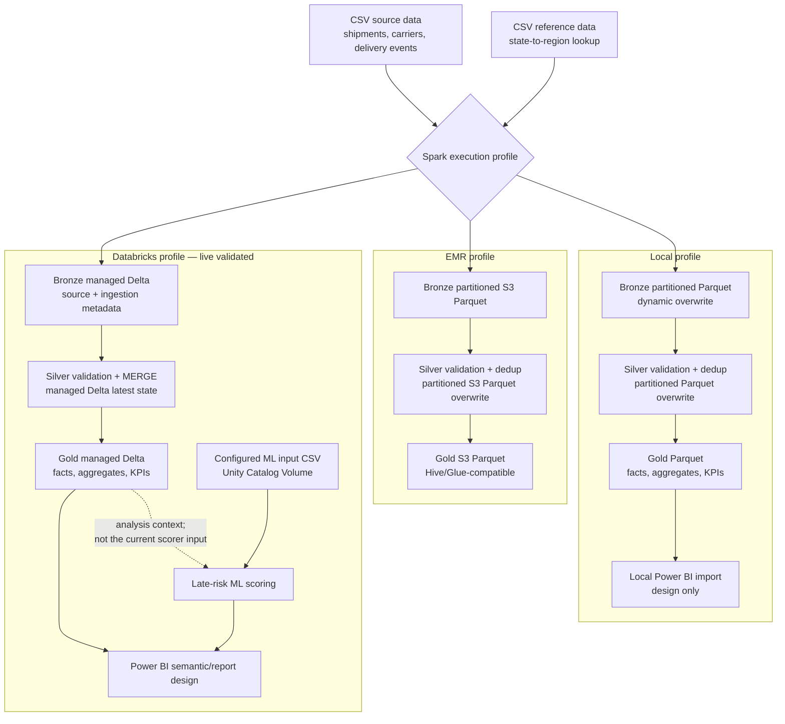
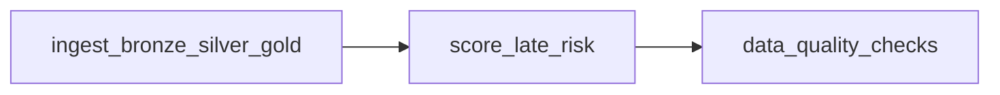

# Transportation Lakehouse Architecture

## Purpose

The project converts shipment, carrier, delivery-event, and region-reference
CSV data into quality-controlled operational facts and decision-support
outputs. It shares transformation logic across three execution profiles while
keeping each platform's storage and catalog behavior explicit.

- **Local:** development and tests with partitioned Parquet; the dev profile
  disables Hive registration and can fall back to JSON for specific Windows
  Hadoop write failures.
- **Amazon EMR:** S3-backed Parquet, Hive/Glue-compatible registration, and
  `spark-submit`/YARN deployment artifacts. A live EMR run is not claimed.
- **Databricks:** serverless Lakeflow Jobs, Unity Catalog Volumes for files,
  managed Delta tables, and Silver Delta MERGE. The development workflow has
  been live-validated with synthetic inputs. Phase 15 correctness repairs are
  locally regression-tested and bundle-validated, but not live-rerun.

## End-to-end topology


```mermaid
flowchart TB
    SRC["CSV source data<br/>shipments, carriers, delivery events"]
    REF["CSV reference data<br/>state-to-region lookup"]
    PROFILE{"Spark execution profile"}
    SRC --> PROFILE
    REF --> PROFILE

    subgraph LOCAL["Local profile"]
        LB["Bronze partitioned Parquet<br/>dynamic overwrite"] --> LS["Silver validation + dedup<br/>partitioned Parquet overwrite"]
        LS --> LG["Gold Parquet<br/>facts, aggregates, KPIs"]
        LG --> LP["Local Power BI import<br/>design only"]
    end

    subgraph EMR["EMR profile"]
        EB["Bronze partitioned S3 Parquet"] --> ES["Silver validation + dedup<br/>partitioned S3 Parquet overwrite"]
        ES --> EG["Gold S3 Parquet<br/>Hive/Glue-compatible"]
    end

    subgraph DBX["Databricks profile — live validated"]
        DB["Bronze managed Delta<br/>source + ingestion metadata"] --> DS["Silver validation + MERGE<br/>managed Delta latest state"]
        DS --> DG["Gold managed Delta<br/>facts, aggregates, KPIs"]
        DG -. "analysis context;<br/>not the current scorer input" .-> ML["Late-risk ML scoring"]
        MLC["Configured ML input CSV<br/>Unity Catalog Volume"] --> ML
        DG --> BI["Power BI semantic/report design"]
        ML --> BI
    end

    PROFILE --> LB
    PROFILE --> EB
    PROFILE --> DB
```

The Databricks path supplies the requested Bronze Delta → Silver validation
and MERGE → Gold analytics sequence. The dashed Gold-to-ML edge represents
decision-support context only: the implemented ML task reads a separate,
configured CSV and does not query `fct_shipment`. Power BI is a design and
connection specification, not a deployed report.

## Runtime comparison

| Concern | Local | Amazon EMR | Databricks |
| --- | --- | --- | --- |
| Spark session | Package creates local PySpark session | Package creates/configures YARN Spark session | Package reuses the runtime-managed session |
| Input storage | `data/sample` by dev default | Configured S3 paths | Configured Unity Catalog Volume paths |
| Table format | Parquet; dev-only JSON fallback for a specific Windows failure | Parquet | Managed Delta |
| Catalog behavior | Optional Hive; disabled by dev default | Hive/Glue-compatible registration | Unity Catalog three-level names |
| Bronze write | Partitioned Parquet overwrite | Same Parquet contract on S3 | Partitioned `saveAsTable` Delta overwrite |
| Silver write | Deterministic partitioned Parquet overwrite | Same Parquet contract on S3 | First-load Delta create, then keyed SQL MERGE |
| Gold write | Partitioned Parquet overwrite | Partitioned S3 Parquet overwrite | Partitioned managed Delta overwrite |
| Orchestration | CLI daily/backfill | EMR step templates calling CLI | Three-task serverless Lakeflow Job |
| Validation status | Exercised with synthetic sample data | Artifacts/configuration only | Development bundle and workflow live-validated |

## Runtime configuration and resources

Configuration is merged from `config/base.yaml` and the selected environment
file. CLI overrides can replace paths, Spark profile, Hive database, Unity
Catalog names, resource base path, and failure behavior.

The installed wheel intentionally does not package repository YAML, JSON
schemas, SQL, samples, or tests. Databricks bundle tasks therefore receive:

- a synced `config/databricks.yaml` plus `config/base.yaml`;
- a synced repository resource root for `config/schemas` and `sql/staging`;
- configured Volume paths for raw/reference/quarantine/audit/ML files; and
- the synced `tests/data_quality` tree for the quality task.

Local and EMR omit the bundle resource flags and retain repository-relative
defaults. This prevents Databricks path repair from changing their behavior.

## Daily and backfill orchestration

`transport_etl.main` dispatches two jobs:

- `daily` resolves one run date and executes the full ETL flow.
- `backfill` enumerates an inclusive date range and invokes the daily flow for
  each date, honoring the configured fail-fast setting.

The daily job:

1. Resolves dated or fallback CSV inputs and the region lookup.
2. Loads schema contracts and performs initial quality checks.
3. Executes staging SQL, standardization, and region enrichment.
4. Builds/publishes Bronze records with ingestion metadata.
5. Builds/publishes Silver records with deterministic validation,
   deduplication, lineage, and target-aware persistence.
6. Builds Gold facts, aggregates, and analytical tables from the canonical
   in-memory Silver results.
7. Publishes all eight Gold outputs.

Gold does not reread the physical Silver tables during the same run. The
validated, deduplicated Silver DataFrames that were published are the inputs
to staging SQL and enrichment immediately before Gold construction.

## Bronze layer

Bronze uses the existing entity ingestion modules and adds operational
metadata:

| Column | Meaning |
| --- | --- |
| `_ingested_at` | Spark ingestion timestamp |
| `_source_file` | Resolved source path |
| `_batch_id` | Stable job/date batch identifier |
| `_run_date` | Batch run date |

The layer enforces explicit schemas during CSV reading and writes invalid
records to configured quarantine storage. It preserves source columns; Silver
owns conformance rules.

Logical tables are `raw_shipments`, `raw_carriers`, and
`raw_delivery_events`. Local/EMR resolves them through the configured Hive
database when registration is enabled. Databricks resolves each as
`<catalog>.<bronze_schema>.<table>`.

## Silver layer

Silver produces:

| Table | Business key |
| --- | --- |
| `stg_shipments` | `shipment_id` |
| `stg_carriers` | `carrier_id` |
| `stg_delivery_events` | `event_id` |

### Validation and quarantine

Implemented rules cover:

- required null/blank values;
- duplicate business keys;
- configured allowed values;
- non-negative numeric measures;
- timestamp ordering;
- schema drift; and
- rows removed by deterministic deduplication.

Quarantined Silver rows retain source identity and receive table/rule/run
context. Schema-drift and required-null findings are configured as blocking.
Repeated business keys are nonblocking because Silver resolves the latest
update deterministically and records superseded rows.

### Deterministic latest state

Duplicate resolution orders records by `updated_at` descending with nulls last,
then uses entity-specific stable tie-breakers. Silver lineage includes its
valid-from timestamp, source update timestamp, batch ID, and run date.

### Databricks MERGE

On the first Databricks load, a missing target is created with
`CREATE TABLE ... USING DELTA AS SELECT`. Later loads register the batch as a
temporary view and execute `MERGE INTO` using the table's business key:

- matched keys update all non-key columns from the incoming latest record;
- unmatched keys insert the complete source row; and
- source duplicate handling prevents multiple rows from matching one target.

This behavior was live-validated for first load, rerun, and a deterministic
shipment update. It is not used on local or EMR.

## Gold layer

The Gold schema contains eight managed analytical tables on Databricks and the
same logical outputs as Parquet on local/EMR:

| Table | Grain | Responsibility |
| --- | --- | --- |
| `dim_carrier` | (`carrier_id`, snapshot `p_date`) | Carrier attributes and operating status |
| `fct_shipment` | Latest row per `shipment_id` | Shipment delivery, route, transit, cost, and exception facts |
| `fct_delivery_event` | Latest row per `event_id` | Event timeline, attempt, delay, and exception facts |
| `agg_shipment_daily` | (`p_date`, `region_code`, `carrier_id`) | Daily additive shipment/event totals |
| `kpi_delivery_daily` | (`p_date`, `region_code`, `carrier_id`) | Dashboard-ready delivery KPIs |
| `carrier_performance` | (`p_date`, `carrier_id`, `service_mode`) | Carrier/service-mode comparison |
| `route_performance` | (`p_date`, origin region, destination region, `carrier_id`) | Route/lane comparison |
| `delivery_exception_summary` | (`p_date`, `event_type`, `carrier_id`, `region_code`) | Exception category and delay summary |

Supported measures include shipment volume, delivered/on-time/late/exception
counts and rates, first-attempt success, transit hours, delay minutes,
shipping cost, distance, weighted cost per mile, and event density. Unsupported
business fields are documented rather than inferred.

## Publication and naming

`publish.hive_writer.write_partitioned_table` dispatches local/EMR Parquet and
Databricks Bronze/Gold Delta writes. Its configured partition contract is
`p_date`, `region_code`, and `carrier_id`; the writer derives or fills missing
values. Databricks Silver is the deliberate exception: its managed targets are
created and updated through keyed Delta MERGE, and this implementation does not
claim physical partitioning for those tables.

Databricks identifiers are resolved from configuration:

```text
<catalog>.<bronze_schema>.<bronze_table>
<catalog>.<silver_schema>.<silver_table>
<catalog>.<gold_schema>.<gold_table>
```

Managed table writers do not use the compatibility `curated_base_path` on
Databricks. Unity Catalog owns their storage locations. The configured Volume
is used for file-based inputs, quarantines, audit artifacts, and ML files; the
bundle does not create catalogs, schemas, or Volumes.

## Rerun and idempotency contract

| Layer | Local / EMR | Databricks |
| --- | --- | --- |
| Bronze | Configured overwrite/dynamic partition behavior; stable source payload for unchanged input | Managed Delta overwrite; ingestion audit timestamps may change |
| Silver | Deterministic latest-record result plus overwrite | Business-key MERGE reaches the same latest-state rows on rerun |
| Gold | Deterministic builders plus partitioned overwrite | Deterministic builders plus managed Delta overwrite |

Idempotency means reruns do not create uncontrolled duplicate business keys;
it does not mean every audit timestamp remains byte-identical. The live
Databricks validation confirmed unique tested keys after repeated runs and a
stable deterministic MERGE update.

## Decision-support ML

The ML package trains logistic regression and histogram gradient boosting on
synthetic shipment data. The target is late delivery, and prediction-time
features are restricted to booking-known attributes plus carrier/route
outcomes whose pickup and observed delivery both precede the shipment being
scored.

Chronological splitting sorts by `pickup_ts` and assigns the earliest 70% to
training, the next 15% to validation, and the latest 15% to test. Leakage guards
reject actual-delivery and post-event outcome fields. The scoring contract
produces shipment ID, pickup timestamp, risk probability, risk band, and
predicted-late flag.

The Databricks job reads its ML input from a configured CSV in a Volume and
writes model, evaluation, and score files under the configured audit path. It
does not currently read a managed Gold table or publish scores as Delta. The
task is a batch train-and-score demonstration, not a reusable prospective
scoring service. The documented synthetic evaluation has weak held-out signal
and must not be presented as a production model.

## Lakeflow and bundle orchestration


```mermaid
flowchart LR
    T1["ingest_bronze_silver_gold"] --> T2["score_late_risk"]
    T2 --> T3["data_quality_checks"]
```

The Declarative Automation Bundle builds one Python wheel from the repository
root and declares one serverless Lakeflow Job. All tasks use console entry
points from that wheel. Dependencies make ML wait for ETL and make the quality
task wait for both.

The configured daily UTC schedule is paused. The development target was
validated, deployed, and run end to end; each task completed successfully.
Production deployment and recurring schedule operation are not claimed.

The data-quality task executes the repository's existing synthetic
`tests/data_quality` suite inside the wheel-task process and propagates nonzero
pytest status as a task failure. It does not constitute a full query-based
reconciliation of the newly written Unity Catalog tables.

## Power BI consumption boundary

The repository includes a semantic-model and report specification for:

1. Executive Supply Chain Overview.
2. Carrier & Route Performance.
3. Delivery Risk & Exceptions.

Databricks Gold tables can be selected through a SQL Warehouse connection;
local Parquet/JSON files can be imported through Power Query. File-based risk
scores require a separate CSV import and shipment-key merge. No PBIX,
published model, screenshot, or refresh schedule exists.

## Data quality and failure behavior

- Invalid rows are quarantined rather than silently discarded.
- Quality summaries log entity, failed rule, and invalid count.
- Managed runtimes receive a raised/nonzero failure when ETL or quality checks
  fail.
- Tests cover pure logic, Spark integration, SQL parity, data-quality rules,
  ML behavior, runtime resource paths, wheel builds, and bundle structure.
- Local Spark/Windows Hadoop limitations are not reclassified as Databricks or
  business-logic success.

## Observability and security boundaries

- Application logging supports structured JSON and contextual job/run fields.
- EMR templates direct Spark logs to operator-configured destinations.
- Bundle authentication is supplied by a named local Databricks CLI profile.
- Repository configuration contains no workspace token, user identity, cloud
  account ID, bucket name, IAM role, or production endpoint.
- Environment objects and credentials must be provided outside source control.

## Verified and unverified boundaries

### Verified or implemented

- Local daily/backfill behavior with synthetic sample data.
- Target-aware Parquet versus Delta publication logic.
- Databricks development bundle validation, deployment, three-task workflow,
  managed-table queries, Silver MERGE, rerun uniqueness, Gold sanity, ML score
  validity, and the Lakeflow data-quality task.
- Power BI semantic/report design and the evidence-bounded DMAIC case study.

### Not claimed

- Production-data behavior or business improvement.
- Live EMR execution.
- Databricks production-target deployment or active scheduling.
- Direct Gold-to-ML integration or a managed scoring table.
- Full post-write Unity Catalog reconciliation in the Lakeflow quality task.
- A production-ready model, causality, or automated carrier/routing action.
- A manually built or published Power BI report.
- Six Sigma certification or deployed DMAIC interventions.
