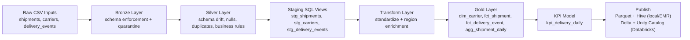

# Transportation Shipment ETL — Supply Chain Lakehouse Architecture

## Overview

This project implements a batch ETL pipeline for supply chain shipment analytics using:

- PySpark and Spark SQL for distributed transformation
- Bronze/Silver/Gold medallion architecture
- Hive-style curated tables on Parquet (local and EMR)
- Delta Lake managed tables on Databricks
- Partitioning by `p_date`, `region_code`, `carrier_id`
- Local development mode, Amazon EMR production mode, and Databricks lakehouse mode

The design prioritizes reproducibility, data quality, and clear table grain for KPI reporting.

## Logical Flow


```mermaid
flowchart LR
    A["Raw CSV Inputs<br/>shipments, carriers, delivery_events"] --> B["Bronze Layer<br/>schema enforcement + quarantine"]
    B --> C["Silver Layer<br/>schema drift, nulls, duplicates, business rules"]
    C --> D["Staging SQL Views<br/>stg_shipments, stg_carriers, stg_delivery_events"]
    D --> E["Transform Layer<br/>standardize + region enrichment"]
    E --> F["Gold Layer<br/>dim_carrier, fct_shipment, fct_delivery_event, agg_shipment_daily"]
    F --> G["KPI Model<br/>kpi_delivery_daily"]
    G --> H["Publish<br/>Parquet + Hive (local/EMR)<br/>Delta + Unity Catalog (Databricks)"]
```

## Pipeline Layers

### 1. Ingestion (Bronze)
- Reads raw CSV files with explicit schema definitions from `config/schemas/*.schema.json`
- Normalizes raw strings (trim/case handling)
- Parses timestamps with configured formats
- Emits invalid records to quarantine path — never silently discarded
- The Bronze layer lives in `src/transport_etl/bronze/`:
  - `metadata.py` — defines the canonical ingestion metadata columns
  - `builder.py` — wraps the existing `transport_etl.ingest` modules to
    attach operational metadata without re-implementing schema parsing
  - `publisher.py` — target-aware write dispatch (Parquet+Hive on
    local/EMR, Delta on Databricks)
- Operational ingestion metadata columns are appended to every Bronze
  record (only fields that can be populated reliably):

  | Column         | Source                                  |
  |----------------|-----------------------------------------|
  | `_ingested_at` | `current_timestamp()` from Spark        |
  | `_source_file` | Source path supplied by the job runner  |
  | `_batch_id`    | Deterministic id derived from `run_date` and `job_name` |
  | `_run_date`    | Batch run date (`YYYY-MM-DD`)           |

- Bronze logical table identifiers:

  | Target     | Table name format              | Example                                |
  |------------|--------------------------------|----------------------------------------|
  | Local/EMR  | `<hive.database>.<table>`      | `curated.raw_shipments`                |
  | Databricks | `<catalog>.bronze.<table>`     | `supply_chain.bronze.raw_shipments`    |

#### Bronze Rerun Semantics
- **Local / EMR** — Parquet write uses `mode=overwrite` with
  `spark.sql.sources.partitionOverwriteMode=dynamic` (set in every
  Spark profile config).  A rerun of the same `run_date` produces an
  identical, deterministic Parquet payload for the source columns;
  `_ingested_at` and `_batch_id` will reflect the rerun (audit only).
- **Databricks** — Delta write uses `saveAsTable` with `mode=overwrite`
  and the same dynamic partition overwrite setting.  Source-column
  content and `_source_file` / `_run_date` values are stable; the
  audit columns are intentionally mutable.

### 2. Silver (validated, deduplicated, region-enriched)
- Lives in `src/transport_etl/silver/`.  Reuses existing helpers
  rather than re-implementing them:
  - `quality.rules.run_quality_rules`
  - `quality.duplicates.split_by_duplicates`
  - `quality.schema_drift.detect_schema_drift`
  - `transform.standardize.standardize_columns`
  - `transform.enrich_region.enrich_shipments_with_region` /
    `enrich_delivery_events_with_region`
- **Business keys** (derived from `config/schemas/*.schema.json`):

  | Silver table            | Business key    |
  |-------------------------|-----------------|
  | `stg_shipments`         | `shipment_id`   |
  | `stg_carriers`          | `carrier_id`    |
  | `stg_delivery_events`   | `event_id`      |

- **Deterministic dedup** — the dedup helper applies a
  "latest record wins" policy ordered by `updated_at` (descending,
  nulls last) followed by entity-specific tie-breaker columns.  The
  same ordering is used everywhere, so reruns are deterministic.

- **Quarantine** — invalid records are routed to
  `<quarantine_path>/<table>/<rule>/...` with the source identity
  preserved as ``__source_identity``.  Rules:
  - `silver_required_nulls`
  - `silver_duplicate_keys`
  - `silver_invalid_allowed_value`
  - `silver_non_negative_metric`
  - `silver_invalid_timestamp_order`
  - `silver_schema_drift`
  - `silver_dropped_by_dedup`

- **Silver lineage columns** appended to every Silver record:

  | Column              | Source                                       |
  |---------------------|----------------------------------------------|
  | `_silver_valid_from`| `current_timestamp()` at build time         |
  | `_silver_updated_at`| Source `updated_at` (JVM fallback otherwise) |
  | `_silver_batch_id`  | Batch identifier from the runner             |
  | `_silver_run_date`  | Run date (`YYYY-MM-DD`) from the runner      |

- Silver logical table identifiers:

  | Target     | Table name format              | Example                                |
  |------------|--------------------------------|----------------------------------------|
  | Local/EMR  | `<hive.database>.<table>`      | `curated.stg_shipments`                |
  | Databricks | `<catalog>.silver.<table>`     | `supply_chain.silver.stg_shipments`    |

#### Silver Rerun Semantics
- **Local / EMR** — Parquet `mode=overwrite` (dynamic partition
  overwrite).  Reruns for the same `run_date` produce an identical
  Silver payload; the lineage columns are stable for the same
  `batch_id`.
- **Databricks** — Delta MERGE (Spark SQL `MERGE INTO` statement) keyed
  on the business key.  Same source + same business key + same
  values = identical target.  The exact contract is documented
  inline in `transport_etl.silver.merge_spec.build_merge_sql`.

### 3. Gold (curated + Phase-6 analytics)
- Preserves the existing models:

  | Table                 | Grain                                  |
  |-----------------------|----------------------------------------|
  | `dim_carrier`         | One row per `carrier_id` per `p_date` snapshot |
  | `fct_shipment`        | One row per `shipment_id` (latest state) |
  | `fct_delivery_event`  | One row per `event_id` (latest event update) |
  | `agg_shipment_daily`  | Daily aggregate at date-region-carrier |
  | `kpi_delivery_daily`  | KPI output at date-region-carrier |

- Phase-6 additional analytics (built on top of the existing Gold
  facts and dimensions):

  | Table                         | Grain | Source |
  |-------------------------------|-------|--------|
  | `carrier_performance`         | `(p_date, carrier_id, service_mode)` | `fct_shipment` + `fct_delivery_event` + `dim_carrier` |
  | `route_performance`           | `(p_date, origin_region_code, destination_region_code, carrier_id)` | `fct_shipment` |
  | `delivery_exception_summary`  | `(p_date, event_type, carrier_id, region_code)` | `fct_delivery_event` + `fct_shipment` |

- These three additional tables are produced by pure-Python builders
  (`transport_etl.transform.build_carrier_performance`,
  `...build_route_performance`,
  `...build_delivery_exception_summary`) and are mirrored by
  Spark SQL files in `sql/gold/`.  Test
  `tests/integration/test_phase6_gold_analytics.py::TestSparkSQLParity`
  asserts the two produce identical results.

- Metrics that are **not** produced in any Phase-6 table (and why):
  revenue / margin (no source field), customer satisfaction score
  (not in source data), carbon / fuel metrics (not in source data),
  lane volume vs prior period (requires a wider time window), carrier
  exclusivity per lane (would require a second pass over the same
  grain), SLA attainment rate (no SLA targets in source data),
  exception cost impact (would require shipment-level cost data
  joined on the event), time-to-recovery from exception event to the
  next DELIVERED event (requires a window join — documented as a
  Phase-7 / future enhancement).  We document these rather than
  manufacturing data, per the task's CRITICAL RULE.

### 2. Data Quality (Silver)
- Detects schema drift against expected schema contracts
- Validates required columns are not null/blank
- Detects duplicate business keys (`shipment_id`, `carrier_id`, `event_id`)
- Applies reusable business rules (allowed values, non-negative metrics, timestamp ordering)

### 3. Staging
- Applies Spark SQL staging logic from `sql/staging/*.sql`
- Produces normalized intermediate views for downstream transforms
- Keeps deduplication and KPI-specific modeling in curated transforms

### 4. Transform and Enrichment
- Standardizes statuses, event types, state/region codes, and carrier text
- Enriches shipment/event records with `region_lookup.csv`
- Builds curated dimensional/fact models with explicit grain

### 5. Publish

Publishing is target-aware and dispatched from `publish/hive_writer.py`:

| Target     | Format  | Registration            | Path style |
|------------|---------|-------------------------|------------|
| Local      | Parquet | Hive DDL (optional)     | Local filesystem |
| EMR        | Parquet | Hive / Glue catalog     | S3 (`s3://`) |
| Databricks | Delta   | Unity Catalog automatic | DBFS (`dbfs:/`) |

The `output_format` parameter selects the backend:
- `"parquet"` (default) — existing behavior, unchanged
- `"delta"` — writes via `saveAsTable` to a Unity Catalog-managed Delta table

For Databricks the table name is a fully-qualified three-part identifier
produced by `common/catalog.resolve_table_name`:

```
supply_chain.gold.fct_shipment
supply_chain.gold.kpi_delivery_daily
```

Catalog, schema, and table names are always read from `config/databricks.yaml` —
never hardcoded in application code.

#### Delta Write Details

- **Write mode**: `overwrite` (dynamic partition overwrite) or `append`
- **Partition contract**: `p_date`, `region_code`, `carrier_id` — identical to Parquet
- **MERGE support**: `publish/delta_writer.py` provides `DeltaMergeSpec` and
  `build_merge_spec` for future Silver-layer upsert operations.  `execute_merge`
  is available but requires the Databricks runtime (not used until Phase 4).
- **No `delta-spark` required locally**: All Delta-specific code is import-guarded;
  the project imports cleanly without `delta-spark` installed.

## Curated Data Model

| Table                 | Grain                                  | Layer |
|-----------------------|----------------------------------------|-------|
| `dim_carrier`         | One row per carrier (latest snapshot)  | Gold  |
| `fct_shipment`        | One row per shipment (latest state)    | Gold  |
| `fct_delivery_event`  | One row per delivery event             | Gold  |
| `agg_shipment_daily`  | Daily aggregate at date-region-carrier | Gold  |
| `kpi_delivery_daily`  | KPI output at date-region-carrier      | Gold  |

## Runtime Modes

### Local
- Config: `config/dev.yaml`
- Reads synthetic sample data under `data/sample/`
- Writes Parquet to `data/local/curated`
- Hive registration disabled by default
- Intended for development, unit/integration tests, and demos

### EMR
- Config: `config/prod.yaml` + runtime CLI overrides
- Reads/writes S3 paths
- Executes batch jobs through `spark-submit` on YARN
- Writes Parquet; Hive/Glue registration enabled
- Uses deployment artifacts under `deploy/emr/`

### Databricks
- Config: `config/databricks.yaml`
- Reuses the active cluster SparkSession (no `getOrCreate` required)
- Writes managed Delta tables to Unity Catalog
- Table names: `catalog.schema.table` (all configuration-driven)
- DBFS paths for raw input staging; Unity Catalog volumes for curated outputs
- Hive registration skipped — Unity Catalog manages metadata automatically
- Deployment via Databricks Asset Bundles / Lakeflow Jobs (future phase)

> **Deployment status**: Databricks configuration and publish abstractions are
> implemented and unit-tested.  End-to-end Delta writes have not yet been
> validated against a live Databricks workspace.

## Quality and Failure Strategy
- Invalid ingestion rows are quarantined, not silently dropped
- Quality rule outcomes are logged with failed rule names and counts
- Configurable fail-fast behavior (`runtime.fail_fast`)
- Deterministic transformation functions support idempotent reruns

### 6. Decision-Support ML Model (Phase 8)
- Lives in `src/transport_etl/ml/` and is documented in `docs/late_risk_model.md`.
- Two estimators from scikit-learn only:
  `LogisticRegression` (linear baseline) and
  `HistGradientBoostingClassifier` (tree-based).  No additional ML
  libraries are introduced.
- Features use **only** booking-time information
  (`shipment_id`, `carrier_id`, `service_mode`, `origin_state`,
  `destination_state`, `distance_miles`, `shipping_cost_usd`,
  `promised_transit_hours`, `pickup_dow` / `_hour` / `_month`,
  and historical aggregates computed **strictly** from shipments
  whose `pickup_ts` is earlier than the current row's
  `pickup_ts`).  No `actual_delivery_ts`, no post-event fields.
- A documented `FORBIDDEN_FEATURE_COLUMNS` list in
  `transport_etl.ml.leakage_audit` is enforced at every
  feature-engineering and scoring boundary.
- **Chronological** 70/15/15 train / validation / test split on
  `pickup_ts`.  Random splits are explicitly disallowed because
  they leak the future into the training set.
- Risk bands (LOW / MEDIUM / HIGH / CRITICAL) with **documented
  thresholds** (0.10, 0.25, 0.50) and a default decision threshold
  of 0.25 for the binary `predicted_late` output.
- CLI entry point: `python -m transport_etl.ml.cli train-and-score`.

### 7. Databricks Deployment (Phase 9)
- Source-controlled **Declarative Automation Bundle** (formerly
  "Databricks Asset Bundles" / DAB) under `deploy/databricks/`.
- The bundle builds a Python wheel locally and uploads it to the
  workspace; tasks invoke the existing `transport-etl` and
  `transport-etl-ml` console scripts (no notebook copies).
- Single **Lakeflow Job** with three sequential tasks:
  1. `ingest_bronze_silver_gold` (Bronze+Silver+Gold refresh)
  2. `score_late_risk` (late-shipment risk scoring)
  3. `data_quality_checks` (data-quality validation)
- All catalog, schema, and storage-path values are
  configuration-driven variables; no credentials, no real
  workspace URLs, no account IDs are committed.
- Bundle validation is a **manual step** — the Databricks CLI
  was not available in the development environment.  See
  `docs/databricks_deployment.md` for the operator command list.

## Observability
- Structured logging with contextual fields (`run_id`, `job`, `env`, `batch_date`)
- Quality summaries include failure counts and rule status
- EMR steps and Spark logs are directed to configured log destinations

## Security and Portfolio Safety
- No credentials are committed
- EMR and S3 artifacts use placeholders for buckets, IAM roles, and cluster IDs
- Databricks configuration uses `dbfs:/` placeholders; no workspace URLs or tokens
- Sensitive values are expected via environment variables or runtime parameters
